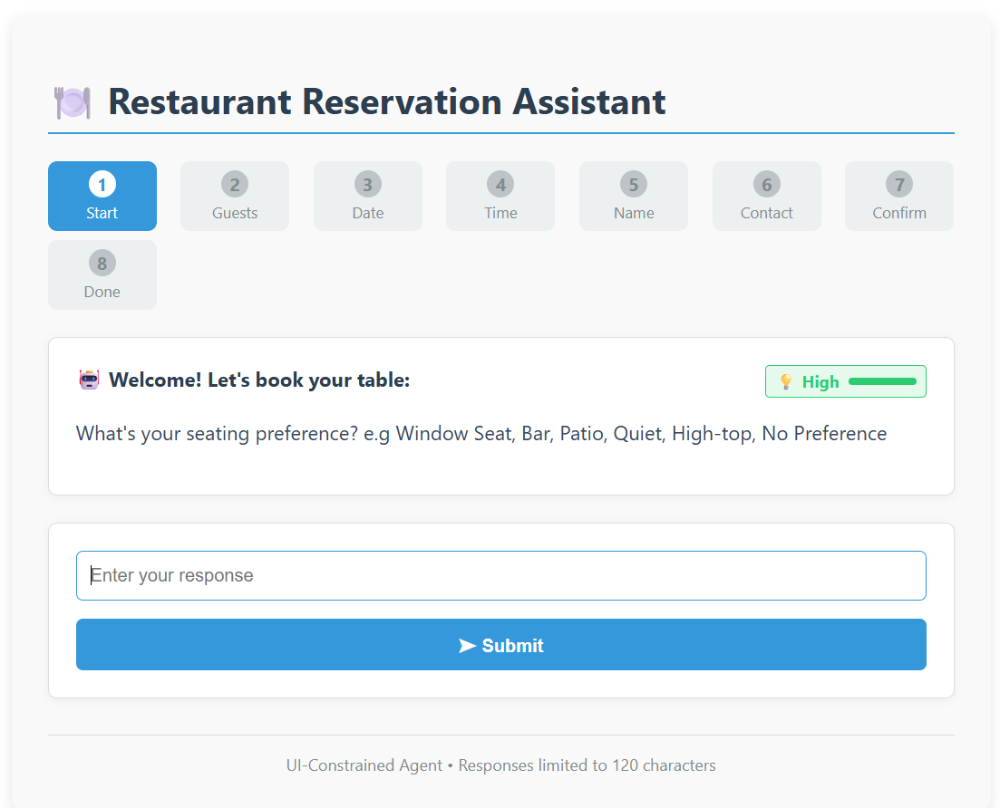
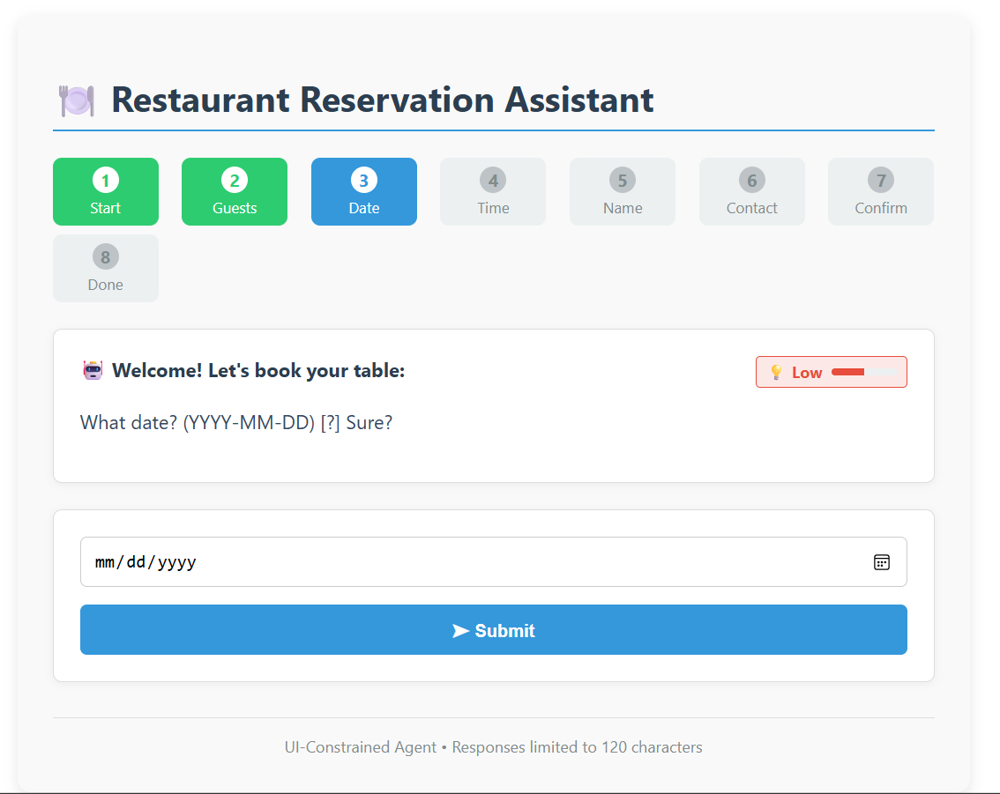
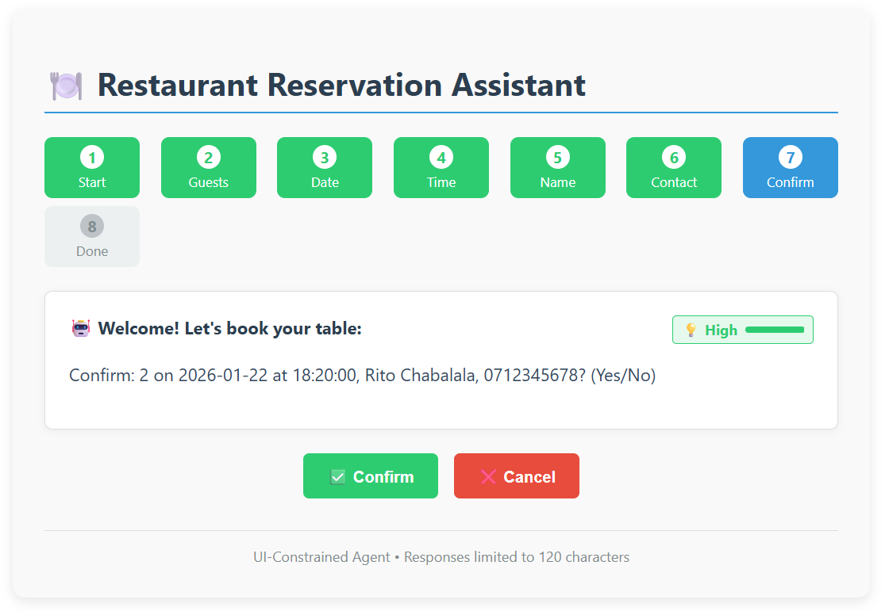
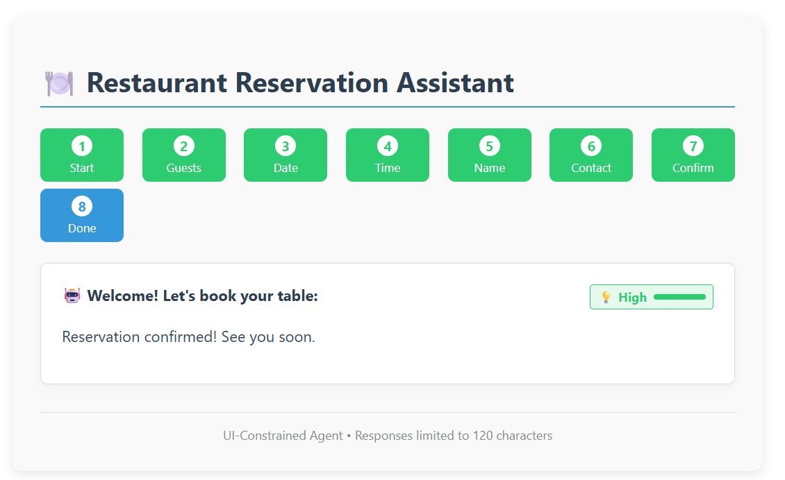

# UI-Constrained Agent: Restaurant Reservation Assistant

This application demonstrates a task-focused assistant where the UI constrains the agent's behavior, ensuring focused interactions without free-form chat.

The UI constraints enforce a predictable, robust interaction flow.

## Screenshots





## How to Run the Application Locally

### Manual Setup (Step-by-Step)

#### Prerequisites
- Python 3.8+ with venv support
- Node.js 14+ and npm
- Git

### Backend Setup (Django REST API)

```bash
# 1) Ensure venv support is installed
sudo apt update
sudo apt install -y python3-venv python3-full

# 2) Navigate to the backend directory
cd backend

# 3) Create a virtual environment
python3 -m venv .venv

# 4) Activate it (Linux/WSL bash)
source .venv/bin/activate

# 5) Upgrade pip inside the venv
python -m pip install --upgrade pip

# 6) Install dependencies
pip install -r requirements.txt

# 7) Run database migrations
python manage.py migrate

# 8) Start the Django development server
python manage.py runserver
```

The backend API will be available at `http://localhost:8000`

### Frontend Setup (React)

Open a **new terminal** window:

```bash
# 1) Navigate to the frontend directory
cd frontend

# 2) Install Node dependencies
npm install

# 3) Start the React development server
npm start
```

The frontend UI will open automatically at `http://localhost:3000`

### Quick Start (Automated Setup)

```bash
# Run the automated setup script
./setup.sh

# Then start backend (Terminal 1)
cd backend && ./start.sh

# Then start frontend (Terminal 2)
cd frontend && ./start.sh
```

### Testing the Application

1. Open your browser to `http://localhost:3000`
2. Click "Start Reservation" to begin
3. Follow the step-by-step guided flow
4. Try entering invalid data (e.g., `2026-02-30`) to see error recovery
5. Observe the confidence indicator and progress tracker

## UI vs Agent vs Memory State Model

### UI Components
- **Task Progress Indicator**: Visual step tracker (Start → Guests → Date → ... → Done)
- **Agent Response Display**: Messages capped at 120 characters
- **Confidence Indicator**: Color-coded certainty (High/Medium/Low)
- **Contextual Inputs**: Form fields adapt to current task step
- **Confirmation Buttons**: Binary choice for final step

### Agent Logic
- State machine driven by `current_step`
- Validates inputs against business rules
- Adjusts `confidence` score based on validity
- Generates constrained responses (≤120 chars)
- Never accepts free-text beyond current field

### Memory State (`ReservationSession`)
- Stores partial inputs (e.g., valid party size even if date is wrong)
- Tracks `progress_percentage` based on completed fields
- Persists state via UUID session ID
- Recovers gracefully from errors without restart

## Failure Scenario and Recovery

### Scenario 1: Invalid Date Entry

**Failure**: User enters invalid date (`2026-02-30`)

**System Response**:
1. Agent detects invalid date via business logic validation
2. Confidence drops to 0.4 → UI shows "Low" (orange/red indicator)
3. Response: `"What date? (YYYY-MM-DD) [?] Sure?"` (118 chars)
4. Task remains on "Date" step — **no forward progression**
5. Progress percentage unchanged (e.g., stays at 40%)

**Recovery Mechanism**:
- User corrects to valid date `2026-06-15`
- Agent validates and accepts input
- Confidence rises to 0.85 → UI shows "Medium" (yellow indicator)
- Task advances to "Time" step
- **Previously entered data preserved** (party size, name, etc.)
- No task restart required — graceful correction

**Key Recovery Features**:
- **Session persistence**: UUID-based session stores partial state in database
- **Step isolation**: Error in one field doesn't invalidate others
- **Visual feedback**: Confidence indicator immediately shows uncertainty
- **Constrained retry**: UI only allows correcting the problematic field

## Why Plain Text Chat Would Break This System

### 1. **Ambiguous Input Parsing**
**UI-Constrained**: User selects date with a date picker → guaranteed valid format  
**Plain Text**: User types "next Tuesday" or "March 5th" → requires NLP + timezone inference  
**Failure Point**: Parsing "next Tuesday" when today is Sunday vs. Monday gives different results

### 2. **No Input Validation Guarantees**
**UI-Constrained**: Party size is a number input (min: 1, max: 20) → invalid entries rejected at input level  
**Plain Text**: User says "a big group" or "like 25 people maybe" → ambiguous/out-of-range values need error handling  
**Failure Point**: System must handle typos, approximations, and edge cases

### 3. **Complex Error Correction**
**UI-Constrained**: User clicks back to "Date" field, changes value, clicks next → precise correction  
**Plain Text**: User says "Actually change the date to next Friday" → must parse intent, identify field, update state  
**Failure Point**: "Change Friday to Saturday" — which Friday? The previous input or a new one?

### 4. **State Management Complexity**
**UI-Constrained**: State machine with explicit steps (greeting → party_size → date → time → confirm)  
**Plain Text**: User jumps around ("7pm on Friday for 4 people, no wait, make it 6") → must track context across turns  
**Failure Point**: Multi-turn corrections create cascading context management issues

### 5. **Invisible Confidence/Progress**
**UI-Constrained**: Visual indicators show progress bar (60%), confidence level (Medium), current step (Time)  
**Plain Text**: No spatial UI elements → confidence must be communicated verbally, adding to 120-char limit  
**Failure Point**: "I'm 60% confident about your Saturday 7pm reservation for 6 — still confirming time" (82 chars just for metadata)

### 6. **Task Drift Prevention**
**UI-Constrained**: Only shows reservation-related inputs → impossible to ask off-topic questions  
**Plain Text**: User can type "Do you have vegan options?" or "What's your cancellation policy?"  
**Failure Point**: Agent must either handle scope creep or refuse, degrading UX

### 7. **Character Limit Conflicts**
**UI-Constrained**: Agent response + UI elements are separate → response can be terse ("Invalid date format")  
**Plain Text**: Must repeat context each turn: "For your party of 6 on Feb 30 (invalid) at 7pm, please re-enter date" (82 chars before instruction)

**Conclusion**: The UI constraints are not limitations — they're the **architecture** that makes the system robust, predictable, and user-friendly. Plain text chat would require 10x more complex NLP, error handling, and state management.

## Project Structure

```
ui-constrained-agent/
├── backend/                    # Django REST API
│   ├── requirements.txt        # Python dependencies
│   ├── manage.py              # Django management script
│   ├── db.sqlite3             # SQLite database
│   ├── reservation_agent/     # Django project settings
│   │   ├── settings.py        # Configuration
│   │   ├── urls.py            # API routing
│   │   └── wsgi.py            # WSGI entry point
│   └── reservations/          # Main app
│       ├── models.py          # ReservationSession model
│       ├── views.py           # Agent logic + API endpoints
│       ├── serializers.py     # Data serialization
│       └── urls.py            # App-level routing
├── frontend/                  # React UI
│   ├── package.json           # Node dependencies
│   ├── public/                # Static assets
│   └── src/
│       ├── App.js             # Main application component
│       └── components/
│           ├── ReservationForm.js      # Form container
│           ├── AgentResponse.js        # 120-char response display
│           ├── ConfidenceIndicator.js  # Visual confidence meter
│           └── TaskProgress.js         # Step progression UI
└── README.md                  # This file
```

## Technical Requirements Met

✅ **Runnable Web Application**: React frontend + Django REST backend  
✅ **120-Character Constraint**: Enforced in `views.py` agent response generation  
✅ **Predefined UI Components**: No free-text chat — only forms, buttons, indicators  
✅ **Partial Task Completion**: Session model stores incremental progress  
✅ **User Correction Without Restart**: Session persists, allows step-by-step fixes  
✅ **Visible Confidence**: Color-coded confidence indicator component  

## Troubleshooting

### Backend Issues
- **Port 8000 already in use**: `sudo lsof -i :8000` then `kill <PID>`
- **Migration errors**: Delete `db.sqlite3` and run `python manage.py migrate` again
- **Module not found**: Ensure virtual environment is activated (`source .venv/bin/activate`)

### Frontend Issues
- **Port 3000 already in use**: `sudo lsof -i :3000` then `kill <PID>`, or set `PORT=3001 npm start`
- **Proxy errors**: Ensure backend is running on port 8000 before starting frontend
- **Module errors**: Delete `node_modules` and `package-lock.json`, run `npm install` again


